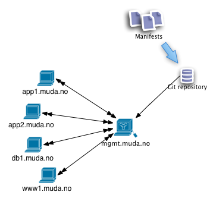

Declarative Configuration Management with&nbsp;Puppet
=====================================================

---

> Configuration Management is a set of tool that let you describe your stack's
> setup in such a way that this configuration management tool can recreate that
> stack from *any known starting point*.

> Where an automation tool like Fabric or Capistrano is *imperative*
> (do this, do that, then do this), configuration management tools tends
> to be *declarative*.

> You say: &ldquo;I have a server and it runs MySQL as this user&rdquo; and the
> configuration management tool figures out how to make that true.

&mdash; Jacob Kaplan-Moss,
[How I Learned To Stop Worrying and Love Deployment][love-dep]

---

Users
=====

* Twitter
* Digg
* Google
* Rackspace
* Red Hat
* Match.com
* Stanford University
* New York University

---

Alternatives
============

* Cfengine
* Chef

Reasons to use Puppet in stead of Chef:

* Bootstrap is easy: `yum install puppet`
* Restricted language makes you think through what you need to do
  and makes it hard to create quick hacks.
* A client&mdash;server installation is more lightweight (Chef needs
  RabbitMQ, CouchDB, Solr)

---

Typical setup (client-server)
=============================

---

Typical setup (client-server)
=============================

* One Puppet master
* Many Puppet agents which pulls the Puppet master for changes over a REST API
* SSL certificate based authentication &mdash; agents needs to get signed
  on the master

The agents does not have access to the source configuration:

1. The agent gathers local facts about its system
2. The agent requests a configuration catalog from the master
3. The master compiles the source configuration to a catalog and returns it to the agent
4. The agent applies the catalog which results in configuration changes

---

Example code
============

https://github.com/oc/roots-puppet

Preparation
===========

Bare

    !sh
    yum install puppet

Master

    !sh
    export HOSTNAME=mgmt.muda.no
    bash < <(curl -s https://github.com/oc/roots-puppet/raw/master/init-master.sh)

Agent

    !sh
    export HOSTNAME=node1.muda.no
    bash < <(curl -s https://github.com/oc/roots-puppet/raw/master/init-agent.sh)

---

Accept certificates / Sign nodes
================================

Start the node (once/test configuration):

    !sh
    /etc/init.d/puppet once -v

To show a list of puppet agent configurations:

    !sh
    /etc/init.d/puppet genconfig

On the puppet master:

    !sh
    May 2 15:51:18 li304-113 puppet-master[3636]: node1.muda.no has a waiting certificate request

    !sh
    puppet cert --sign node1.muda.no

---

Changes in 2.6.x
================

Single binary.

* puppetmasterd → puppet master
* puppetd → puppet agent
* puppet → puppet apply
* puppetca → puppet cert
* ralsh → puppet resource
* puppetrun → puppet kick
* puppetqd → puppet queue
* filebucket → puppet filebucket
* puppetdoc → puppet doc
* pi → puppet describe

---

Resources
=========

Have *type*, *name*, and *parameters*:

    !puppet
    package { "httpd":
      ensure => present,
    }

---

Running puppet code
===================

    !sh
    puppet apply myfile.pp

---

Debugging puppet code
=====================

Master

    !sh
    puppet master --no-deamonize

Agents (files)

    !sh
    puppet --debug --verbose file.pp
    puppet --parseonly file.pp

Configurations

    !puppet
    # Notice the master log
    notice("The value is: ${yourvar}")

    # Notify the clients
    notify{"The value is: ${yourvar}": }

---

Different resource types
========================

    !puppet
    group { "staff":
        ensure => present,
        gid    => 10,
    }

    user { "oc":
        ensure => present,
        gid => 10,
        uid => 1337,
        home => "/home/oc",
        managehome => true,
    }

    cron { "poor-mans-http-ping":
      command => "curl -s http://rootsconf.no/ > /dev/null 2>&1",
      user => "oc",
      minute => "*/1", # Every minute
    }

---

Generic resource types
======================

Building blocks for describing resources not directly supported.

    !puppet
    file { "/etc/localtime":
      ensure => link,
      target => "/usr/share/zoneinfo/Europe/Oslo",
    }

---

Dependencies between resources
==============================

`require` / `before` and `notify` / `subsribe`.

    !puppet
    $nexus_bundle = "/tmp/nexus-oss-webapp-1.9.1.1-bundle.tar.gz"

    file { "/opt/nexus-oss-webapp-1.9.1.1":
      require => Exec["Extract nexus"],
    }

    exec { "Extract nexus":
      cwd     => "/opt",
      command => "tar xvf $nexus_bundle",
      creates => '/opt/nexus-oss-webapp-1.9.1.1',
      path    => "/usr/bin:/bin",
      require => Exec["Fetch nexus"],
    }

    exec { "Fetch nexus":
      cwd     => "/tmp",
      command => "curl -O $nexus_url",
      creates => $nexus_bundle,
      path    => "/usr/bin:/bin",
      require => Package["curl"],
    }

---

Templates and variables
=======================

    !puppet
    $port = 20202
    $allowed_users = ["oc", "stein", "root"] # shouldn't really allow root

    package { "sshd":
      ensure => present,
    }

    file { "/etc/ssh/sshd_config":
      content => template("sshd_config.erb"),
      require => Package["sshd"],
    }

    service { ssh:
      ensure => running,
      enable => true,
      hasstatus => true,
      subscribe => [ Package["sshd"], File["/etc/ssh/sshd_config"] ],
    }

---

`sshd_config.erb`:

    !erb

    Port <%= port %>

    Protocol 2
    HostKey /etc/ssh/ssh_host_rsa_key
    HostKey /etc/ssh/ssh_host_dsa_key
    UsePrivilegeSeparation yes

    KeyRegenerationInterval 3600
    ServerKeyBits 768

    LoginGraceTime 120
    PermitRootLogin yes # Should be set to 'no'
    StrictModes yes

    PubkeyAuthentication yes
    PasswordAuthentication yes # Should be set to 'no'

    UsePAM yes

    <% if allowed_users.any? %>
    AllowUsers <%= allowed_users.join(" ") %>
    <% end %>

---

Running puppet code with templates
==================================

    !sh
    puppet apply --templatedir=templates templates_and_variables.pp

---

Modules
=======

Collection of resources, classes, files, definitions and templates.

    modules/
        nginx/
          manifests/
            init.pp
          files/
            nginx.conf
          templates/
            site.conf.erb

---

Classes
=======

Collection of resources. Not like the OOP term.

`modules/nginx/manifests/init.pp`:

    !puppet
    class nginx {
      package { nginx:
        ensure => present,
      }

      file { "/var/www":
        ensure => directory,
      }

      file { "/etc/nginx/nginx.conf":
        source => "puppet:///modules/nginx/nginx.conf",
        require => Package[nginx],
      }

      service { nginx:
        ensure => running,
        enable => true,
        pattern => "nginx: master process",
        subscribe => File["/etc/nginx/nginx.conf"],
        require => File["/etc/nginx/nginx.conf"],
      }
    }

---

Applying modules
================

    !sh
    puppet apply --modulepath=modules -e 'include nginx'

---

Definitions
===========

Create new resource types.

    !puppet
    define nginx::site($domain, $root) {

      file { $root:
        ensure => directory,
      }

      file { "/etc/nginx/sites-available/${name}.conf":
        ensure => present,
        content => template("nginx/site.conf.erb"),
        require => File[$root],
        notify => Service[nginx],
      }

      file { "/etc/nginx/sites-enabled/${name}.conf":
        ensure => link,
        target => "/etc/nginx/sites-available/${name}.conf",
        require => File["/etc/nginx/sites-available/${name}.conf"],
        notify => Service[nginx],
      }

    }

---

`site.conf.erb` for nginx::site resource:

    !erb
    server {
      listen 80;
      server_name <%= domain %>;

      access_log  /var/log/nginx/<%= name %>.access.log;

      location / {
        root <%= root %>;
        index  index.html;
      }
    }

---

Nodes
=====

Uses classes and invokes definitions from modules.

    manifests/
      nodes.pp
      site.pp
    modules/
        nginx/

`manifests/nodes.pp`:

    !puppet
    node default {
      include ssh
      include git
      include timezone
      include java::oracle
    }

    node "mgmt.muda.no" inherits defaults {
      include puppet::master
      include sonatype::nexus
    }

---

Control Structures
==================

  !puppet
  if $ensure in [ running, stopped ] {
    $ensure_real = $ensure
  } else {
    fail('ensure parameter must be running or stopped')
  }

  !puppet
  case $operatingsystem {
    centos: {
      $package_list = 'openssh-server'
    }
    solaris: {
      $pacakge_list = [ SUNWsshr, SUNWsshu ]
    }
    default: {
      fail("module $module_name does not support $operatingsystem")
    }
  }

---

Facter
======

Facter &mdash; gathers information from the host system &mdash; can be extended. List standard variables that can be used (such as $operationsystem).

---

More
====

* Control structures (if, case)
* Ruby plugins for creating new functions or resource types
* Virtual resources.
* Exported resources.
* Separate environments (development, staging, production)

---

Examples from the configuration
===============================

4 Linode VPS instances (mgmt, node1, node2, db1)

Basic
-----
yum, puppet agent, puppet-master, Users, SSH, Network, NTP, timezone, UFW, git

Servers
-------
apache, mysql, java, nexus

Credits
-------
Eivind Uggedal(uggedal) @uggedal

[uggedal]: http://uggedal.com/
[love-dep]: http://blog.mahalo.com/dev-blog/2011/2/15/jacob-kaplan-moss-at-mahalo.html
